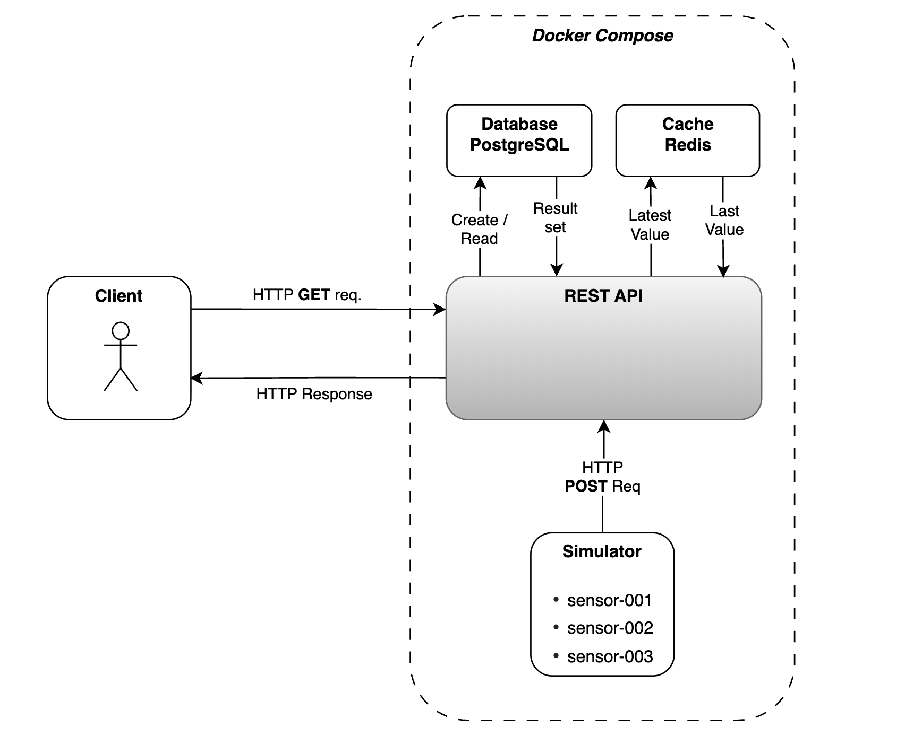
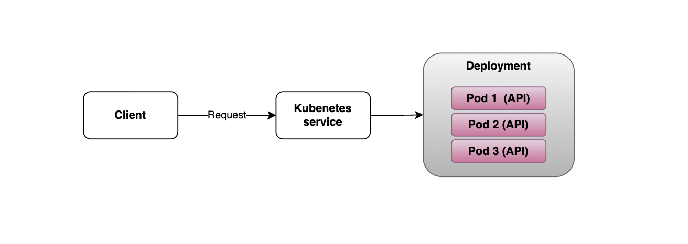
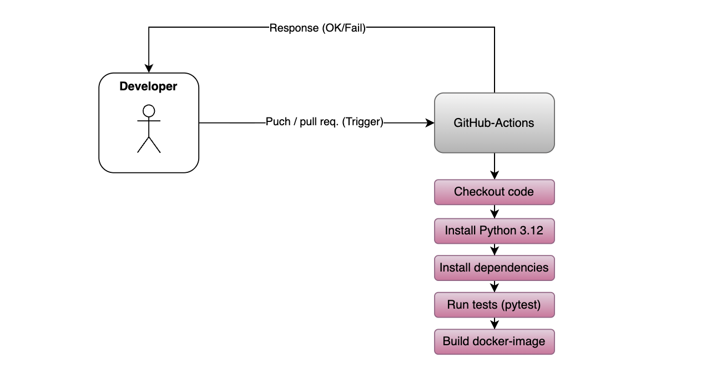

# Arkitekturdiagram

## API-systemet
Diagrammet visar den övergripande arkitekturen för IoT-plattformen. Tre simulerade sensorer skickar mätdata till API:t via `HTTP POST /measurements`. API:t validerar datan och lagrar mätningarna permanent i PostgreSQL. Den senaste mätningen per sensor sparas även i Redis som cache.

Klienter kan hämta data från API:t via GET-anrop. PostgreSQL används för beständig historik medan Redis används för snabb åtkomst till den senaste mätningen. Flödet från sensorerna till API:t och vidare till PostgreSQL är det huvudsakliga write-heavy-flödet.

      
## Kubernetes
När en klient skickar en request hanteras den av Kubernetes service, som fördelar trafiken över de tre Poddana. Deployment ser till att Poddarna körs och att det finns tre repliker. Detta gör att systemet blir mer driftsäkert om någon Pod skulle kracha.

## CI-pipeline
Diagrammet visuallierar CI-pipelinen, hur flödet aktiveras och vad som automatiseras. Vid en puch eller pull-request triggas GitHub-actions som i sin tur kör de definierade instruktionerna (enl. ci.yml). När alla tester och byggsteg genomförts med ett lykcat resultat markeras körningen som grön.
